# Mean reverse pairs trading strategy - Investment Fundamentals (Group 34)

Mean Reversion strategy using Pair trading is one of the most popular hedge funds investment strategies. As markets are constantly shifting in and out of the mean reversal cycles, this strategy bets that prices will return to the average or mean. 

Members: Muhammad Nauman Alam Khan, Tom Invernizzi, Rayna Zhang, Jerome Billiet, Christopher Baumann


```python
# import required libraries
import numpy as np
import pandas as pd
import statsmodels
import statsmodels.api as sm
from statsmodels.tsa.stattools import coint, adfuller
import os
import arrow
import requests
import time
import seaborn as sn
import matplotlib.pyplot as plt
import seaborn as sns; sns.set(style="whitegrid")
import datetime
import yfinance as yf
import statistics
from pandas_datareader import data as pdr
import matplotlib 

# set same font size for a plots
font = {'family' : 'normal',
        'weight' : 'normal',
        'size'   : 20}

matplotlib.rc('font', **font)
```

## 1. Get stock data


We are considering the following 7 companies to select a sutiable pair: 
<ol>
<li>Goldman Sachs (GS)</li>
<li>JP Morgan (JPM)</li>
<li>Citi Bank (C)≤</li>
<li>Bank of America (BAC)</li>
<li>Morgan Stanley (MS)</li>
<li>Wells Fargo (WFC)</li>
<li>Bank of New York Mellon (BK)</li>
</ol>


```python
# specify tickers
ticker = ["GS", "JPM", "C", "BAC", "MS", "WFC", "BK"]

# specify period of intrerest
start = datetime.datetime(2015, 1, 1)
end = datetime.datetime(2019, 1, 1)

# get data from yahoo
df = pdr.get_data_yahoo(ticker, start, end)['Close']
df.tail()
```

    [*********************100%***********************]  7 of 7 completed


<div>
<style scoped>
    .dataframe tbody tr th:only-of-type {
        vertical-align: middle;
    }

    .dataframe tbody tr th {
        vertical-align: top;
    }

    .dataframe thead th {
        text-align: right;
    }
</style>
<table border="1" class="dataframe">
  <thead>
    <tr style="text-align: right;">
      <th></th>
      <th>BAC</th>
      <th>BK</th>
      <th>C</th>
      <th>GS</th>
      <th>JPM</th>
      <th>MS</th>
      <th>WFC</th>
    </tr>
    <tr>
      <th>Date</th>
      <th></th>
      <th></th>
      <th></th>
      <th></th>
      <th></th>
      <th></th>
      <th></th>
    </tr>
  </thead>
  <tbody>
    <tr>
      <th>2018-12-24</th>
      <td>22.730000</td>
      <td>44.490002</td>
      <td>49.259998</td>
      <td>156.350006</td>
      <td>92.139999</td>
      <td>37.009998</td>
      <td>43.599998</td>
    </tr>
    <tr>
      <th>2018-12-26</th>
      <td>24.110001</td>
      <td>46.160000</td>
      <td>51.439999</td>
      <td>162.929993</td>
      <td>95.959999</td>
      <td>39.299999</td>
      <td>45.590000</td>
    </tr>
    <tr>
      <th>2018-12-27</th>
      <td>24.370001</td>
      <td>46.820000</td>
      <td>51.770000</td>
      <td>165.410004</td>
      <td>97.040001</td>
      <td>39.660000</td>
      <td>45.529999</td>
    </tr>
    <tr>
      <th>2018-12-28</th>
      <td>24.389999</td>
      <td>46.650002</td>
      <td>51.830002</td>
      <td>163.029999</td>
      <td>96.830002</td>
      <td>39.369999</td>
      <td>45.779999</td>
    </tr>
    <tr>
      <th>2018-12-31</th>
      <td>24.639999</td>
      <td>47.070000</td>
      <td>52.060001</td>
      <td>167.050003</td>
      <td>97.620003</td>
      <td>39.650002</td>
      <td>46.080002</td>
    </tr>
  </tbody>
</table>
</div>


## 2. Explore data and select pairs based on correlation


```python
# look at the stocks plot to get an overview

for i in ticker:
    figure = plt.figure(figsize=(31,12))
    plt.title(i, font)
    plt.plot(df[i])
    figure.show
```

    findfont: Font family ['normal'] not found. Falling back to DejaVu Sans.


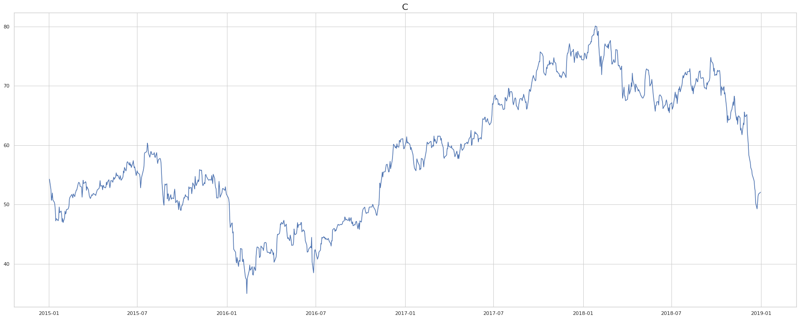


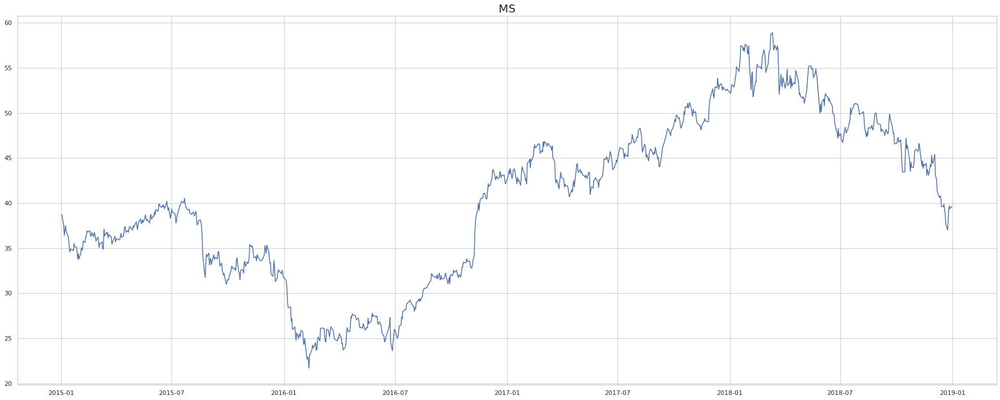


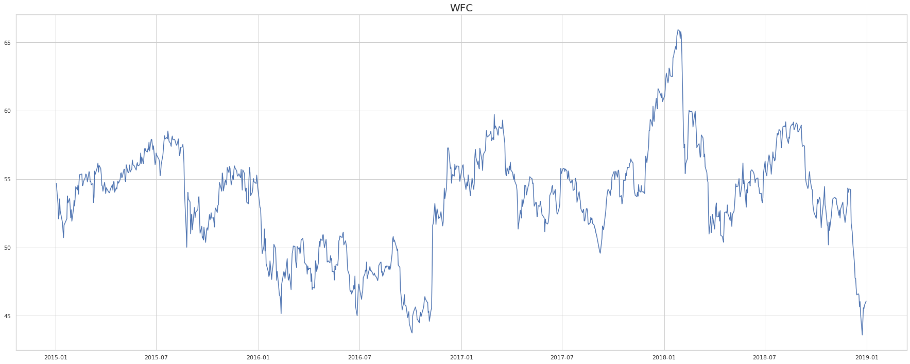


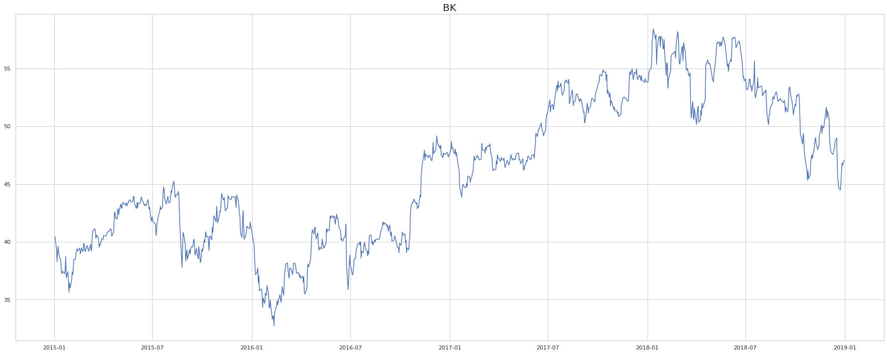


```python
# create correlation table to select correlated pair
corr_matrix = df.corr()

# visualize correlation matrix with a heatmap
fig, ax = plt.subplots(figsize=(35,12))
sn.heatmap(corr_matrix, annot=True, ax=ax)
```


    <matplotlib.axes._subplots.AxesSubplot at 0x121e84a30>


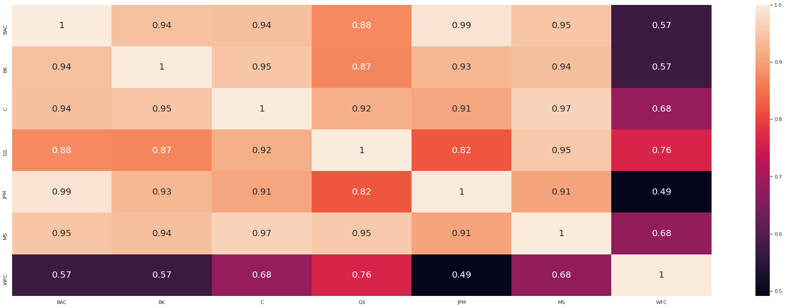


We decided to move on with Morgan Stanley and Citi Bank since they are very strongly correlated (0.97).


```python
# choose pair to continuue with
SS1 = "MS"
SS2 = "C"
S1 = df[SS1]
S2 = df[SS2]
```


```python
# visualize selected pair
figure = plt.figure(figsize=(31,12))
plt.title((SS1,SS2))
plt.plot(S1, label=SS1)
plt.plot(S2, label=SS2)
plt.legend()
figure.show
```


    <bound method Figure.show of <Figure size 2232x864 with 1 Axes>>


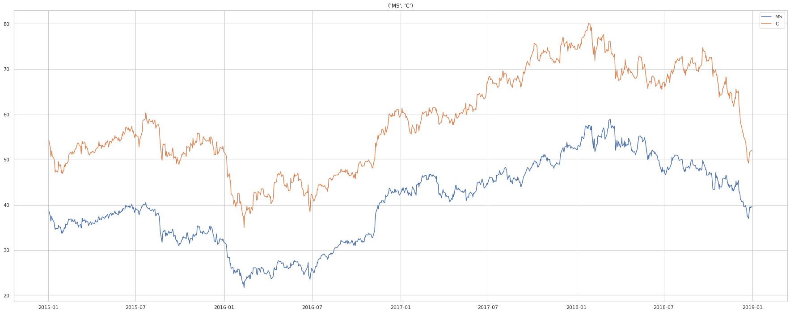


## 3. Calculate & visualize spread and ratio


```python
# spread
spread = S1-S2
spread.plot(figsize=(31,12), color="gold")
plt.axhline(spread.mean(), color='black')
plt.xlim(start, end)
plt.legend(['Spread']);
```


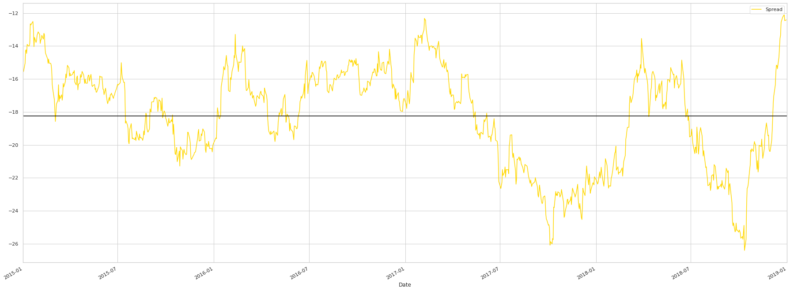


```python
# ratio
ratio = S1/S2
ratio.plot(figsize=(31,12), color="gold")
plt.axhline(ratio.mean(), color='black')
plt.xlim(start, end)
plt.legend(['Price Ratio']);
```


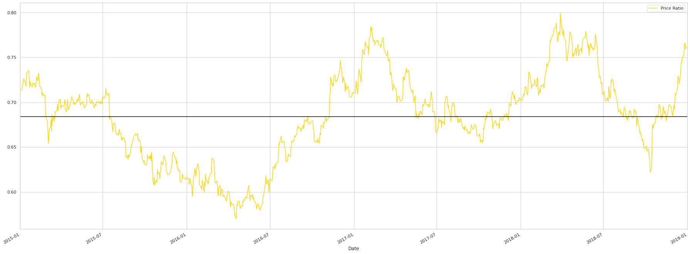


```python
# calculate and plot z-score for ratio over time
def zscore(series):
    return (series - series.mean()) / np.std(series)

z_scores = zscore(ratio)

z_scores.plot(figsize=(31,12), color="gold")
plt.axhline(zscore(ratio).mean(), color="black")
plt.axhline(1.0, color='red', linestyle="--")
plt.axhline(-1.0, color='red', linestyle="--")
plt.xlim(start, end)
plt.show()
```


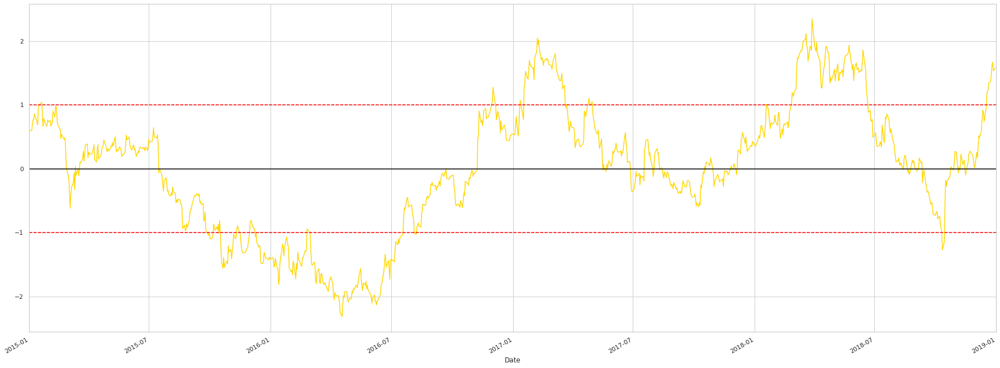


## 4. Trading alogrithm/ strategy


```python
# Trading algorithm
def trade(S1, S2, window1, window2):
    
    # If window length is 0, algorithm doesn't make sense, so exit
    if (window1 == 0) or (window2 == 0):
        return 0
    
    # Compute rolling mean and rolling standard deviation
    ratios = S1/S2
    ma1 = ratios.rolling(window=window1,
                               center=False).mean()
    ma2 = ratios.rolling(window=window2,
                               center=False).mean()
    std = ratios.rolling(window=window2,
                        center=False).std()
    zscore = (ma1 - ma2)/std
    
    S1_change = S1.pct_change()
    S2_change = S2.pct_change()
    
    # lists for output generation
    trade_entry = []
    trade_exit = []
    returns_list = []
    average_capital = []
    typeoftrade_S1 =[]
    typeoftrade_S2 =[]
    success_trades = 0
    loss_trades = 0
    
    # balances
    Return = 0
    S1_value = 0
    S2_value = 0
    countS1 = 0
    countS2 = 0
    
    for i in range(len(ratios)):
        # Transactions when z < -2
        if zscore[i] < -2 and (countS1 + countS2) == 0:
            countS1 += 1
            countS2 += -ratios[i]
            S1_value += -S1[i] * countS1  # long in S1
            S2_value += S2[i] * -countS2  # short in S2 (here it has to be poisitive, but down there negative)
            trade_entry.append(ratios.index[i])
            typeoftrade_S1.append("Long")
            typeoftrade_S2.append("Short")
            average_capital.append(2*abs(S1_value))
                                  
            #print("")
            #print("++++++++++ INVEST ++++++++++")
            #print("Time ", ratios.index[i])
            #print('Long S1, short S2,  Z-score: %s;  S1: %s; S2: %s;  Ratio: %s'%(zscore[i], S1[i], S2[i], ratios[i]))
            #print("S1:",S1_value, "S2:", S2_value)
            #print("CountS1:", countS1, "CountS2:", countS2)
        # Transactions when z > 2
        elif zscore[i] > 2 and (countS1 + countS2) == 0:
            countS1 += -1
            countS2 += ratios[i]
            S1_value += S1[i]  # short S1
            S2_value += -S2[i] * ratios[i]  # long S2
            trade_entry.append(ratios.index[i])
            typeoftrade_S1.append("Short")
            typeoftrade_S2.append("Long")
            average_capital.append(2*abs(S1_value))
            
            #print("")
            #print("++++++++++ INVEST ++++++++++")
            #print("Time ", ratios.index[i])
            #print('Short S1, Long S2,  Z-score: %s;  S1: %s; S2: %s; Ratio: %s'%(zscore[i], S1[i], S2[i], ratios[i]))
            #print("S1:",S1_value, "S2:", S2_value)
            #print("CountS1:", countS1, "CountS2:", countS2)
        # Clear positions if the z-score between 1 and -1
        elif abs(zscore[i]) < 1 and (abs(countS1) + abs(countS2) !=0):
            S1_sale = S1[i] * countS1 
            S2_sale = S2[i] * countS2
            
            potential_win_loss = (S1_sale + S1_value) + (S2_sale+S2_value)
            return_in_pct = potential_win_loss/ (abs(S1_value) + abs(S2_value))
            
            # increase profitability of proceeded trades
            if (potential_win_loss > 5):
                Return += potential_win_loss
                returns_list.append(potential_win_loss)
                trade_exit.append(ratios.index[i])
                
                #print("")
                #print("++++++++++ SALE ++++++++++")
                #print("Time ", ratios.index[i], "Cum. Return:", Return)
                #print('Exit: %s;  Z-score: %s;  S1: %s;  S2: %s;  Ratio: %s'%(Return, zscore[i], S1[i], S2[i], ratios[i]))
                #print(S1_sale, S2_sale)
                print("Awesome! Return of %s, in percent: %s"%(potential_win_loss, 100*return_in_pct))
                
                countS1 = 0
                countS2 = 0
                S1_value = 0
                S2_value = 0
                success_trades += 1
                
            # limit potential for loss
            elif (potential_win_loss < -5):
                Return += potential_win_loss
                returns_list.append(potential_win_loss)
                trade_exit.append(ratios.index[i])
                
                #print("")
                #print("++++++++++ SALE ++++++++++")
                #print("Time ", ratios.index[i], "Cum. Return:", Return)
                #print('Exit: %s;  Z-score: %s;  S1: %s;  S2: %s;  Ratio: %s'%(Return, zscore[i], S1[i], S2[i], ratios[i]))
                #print(S1_sale, S2_sale)
                print("Bad trade! Have to take a loss of %s, in percent: %s"%(potential_win_loss, 100*return_in_pct))

                countS1 = 0
                countS2 = 0 
                S1_value = 0
                S2_value = 0
                loss_trades += 1
                
            else:
                #print("Triggered, but not profitable to execute.")
                pass
            
        else:
            pass
        
        trade_dates = dict(zip(trade_entry, trade_exit))
            
    return Return, trade_dates, returns_list, typeoftrade_S1, typeoftrade_S2, zscore, average_capital, success_trades, loss_trades
```


```python
# specify length of train test data split
x = round(0.7 * len(df))
y = x+1
```

### 4.1 Train the algorithm

Note: you can remove the '#' in front of the print to gain more insights for each trade.


```python
# optimize thresholds based on training data
Return, trade_dates, returns_list, typeoftrade_S1, typeoftrade_S2, zscore, average_capital, success_trades, loss_trades = trade(df[SS1].iloc[:x], df[SS2].iloc[:x], 1, 10)

```

    Awesome! Return of 5.167397042272874, in percent: 7.47165524675056
    Awesome! Return of 5.787773930102269, in percent: 8.953858268490537
    Awesome! Return of 5.009005254462792, in percent: 5.987335686349523


```python
# summary of training statistics
print("Absolute return:", Return)
print("Number of success trades:", success_trades)
print("Number of loss trades:", loss_trades)
returnon_capital = Return/statistics.mean(average_capital)
print("Return on capital:", returnon_capital*100,"%")
```

    Absolute return: 15.964176226837935
    Number of success trades: 3
    Number of loss trades: 0
    Return on capital: 20.55252782958857 %


### 4.2 Test the algorithm


```python
# use trained threshold for unseen data
Return, trade_dates, returns_list, typeoftrade_S1, typeoftrade_S2, zscore, average_capital, success_trades, loss_trades = trade(df[SS1].iloc[y:], df[SS2].iloc[y:], 1, 10);
```

    Awesome! Return of 7.735425166469781, in percent: 7.793093894812951
    Awesome! Return of 5.174363389124025, in percent: 4.794628870382043
    Awesome! Return of 5.0714496443562425, in percent: 5.273969895193112
    Awesome! Return of 6.308458871312091, in percent: 7.069093480865329


```python
# summary of training statistics
print("Absolute return:", Return)
print("Number of success trades:", success_trades)
print("Number of loss trades:", loss_trades)
returnon_capital = Return/statistics.mean(average_capital)
print("Return on capital:", returnon_capital*100,"%")
```

    Absolute return: 24.28969707126214
    Number of success trades: 4
    Number of loss trades: 0
    Return on capital: 24.748786956005077 %


```python
# looking at the spread
spread = S1-S2
spread.plot(figsize=(31,12), color="gold")
plt.axhline(spread.mean(), color='black')
plt.xlim(start, end)
plt.legend(['Spread'])
for i,k in trade_dates.items():
    #plt.axvline(pd.Timestamp(i), color = "black")
    #print(i, k)
    plt.axvspan(pd.Timestamp(i), pd.Timestamp(k), color='lightblue', alpha=0.5)
    
plt.show()
```


```python
# detailed/ zoomed-in look at timing and return of trades
a = df[SS1].iloc[y:]
b = df[SS2].iloc[y:]

plt.figure(figsize=(31,12))

plt.plot(a)
plt.plot(b, color="red")

counter = 0

for i,k in trade_dates.items():
    #plt.axvline(pd.Timestamp(i), color = "black")
    #print(i, k)
    plt.axvspan(pd.Timestamp(i), pd.Timestamp(k), color='lightblue', alpha=0.5)
    plt.annotate(("Return: ", round(returns_list[counter])), xy=(pd.Timestamp(k), a[k]), xytext=(pd.Timestamp(k), a[k]-10))
    plt.annotate(typeoftrade_S1[counter], xy=(pd.Timestamp(i), a[i]), xytext=(pd.Timestamp(i), a[i]-5))
    plt.annotate(typeoftrade_S2[counter], xy=(pd.Timestamp(i), b[i]), xytext=(pd.Timestamp(i), b[i]+5))
    counter += 1 
    
plt.show()
```


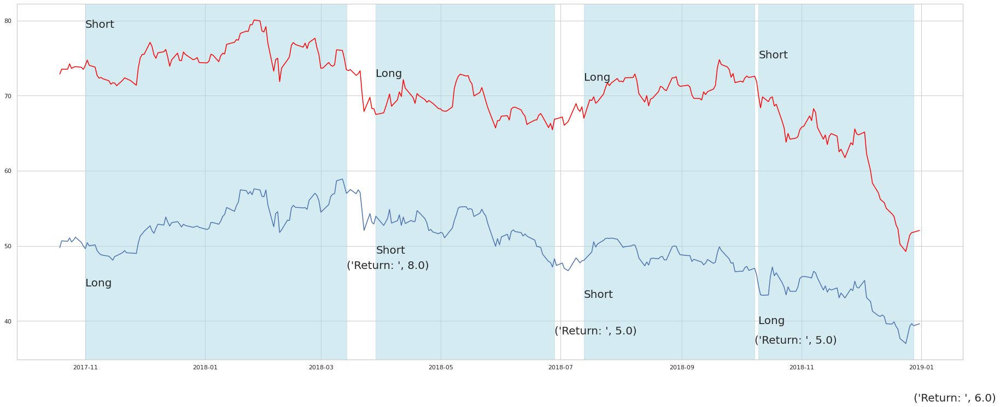


```python
# show thresholds and how they got triggered
plt.figure(figsize=(31,12))
plt.plot(zscore)
plt.axhline(2.0, color='green')
plt.axhline(-2.0, color='green')
plt.axhline(1.0, color='red', linestyle="--")
plt.axhline(-1.0, color='red', linestyle="--")
plt.axhline(0.0, color='black')
#plt.axvline(pd.Timestamp('2017-11-28'), color = "black")

for i,k in trade_dates.items():
    #plt.axvline(pd.Timestamp(i), color = "black")
    #print(i, k)
    plt.axvspan(pd.Timestamp(i), pd.Timestamp(k), color='lightblue', alpha=0.5)
    
plt.show()
```


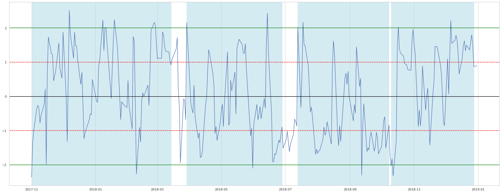


```python

```
